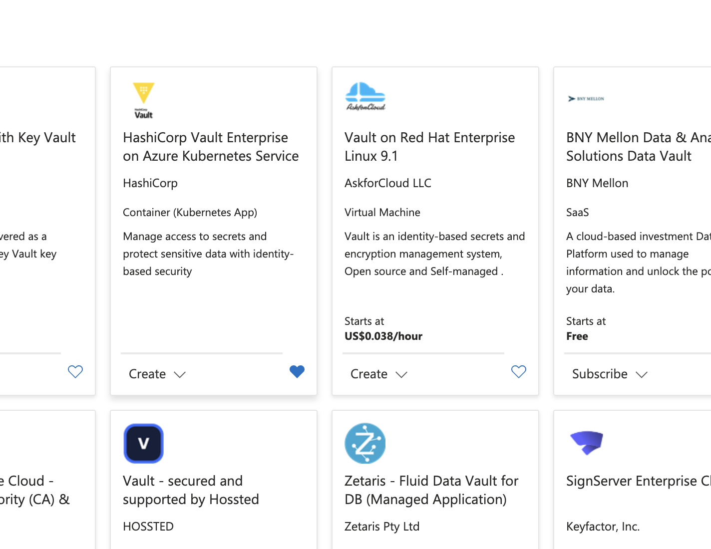
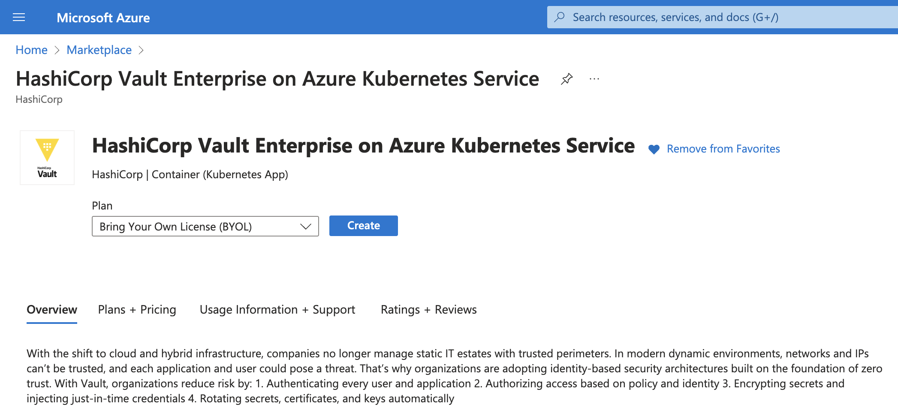
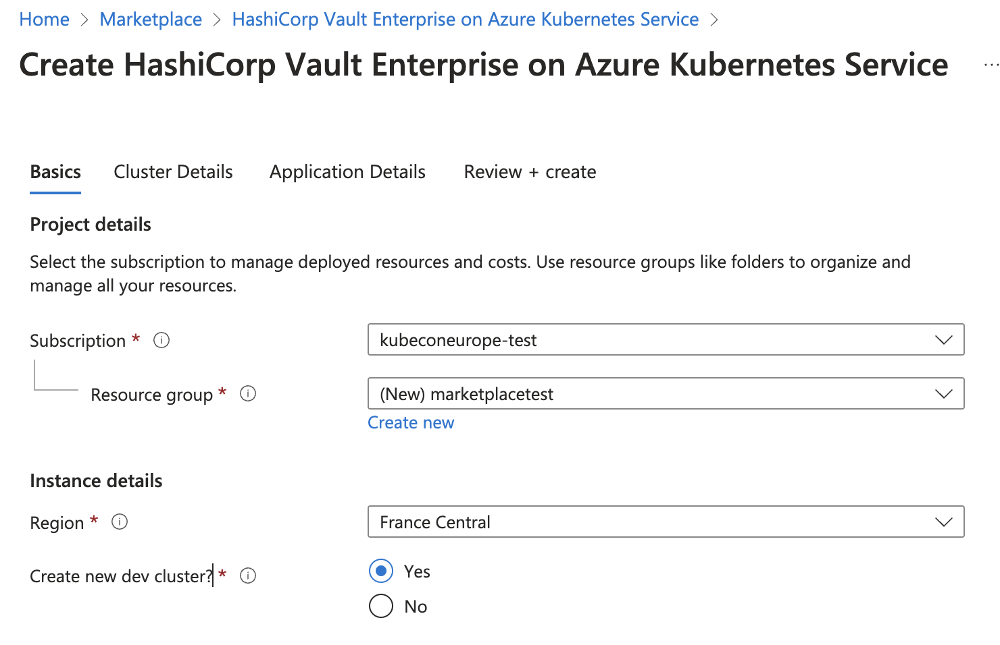
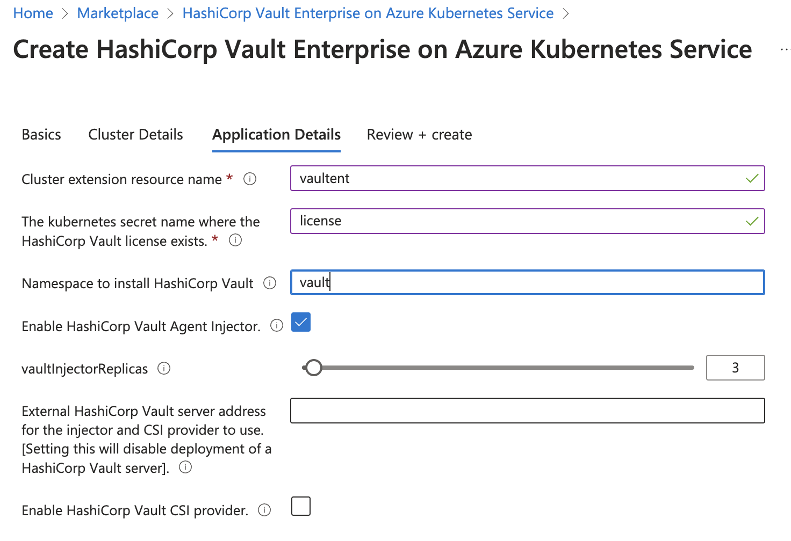
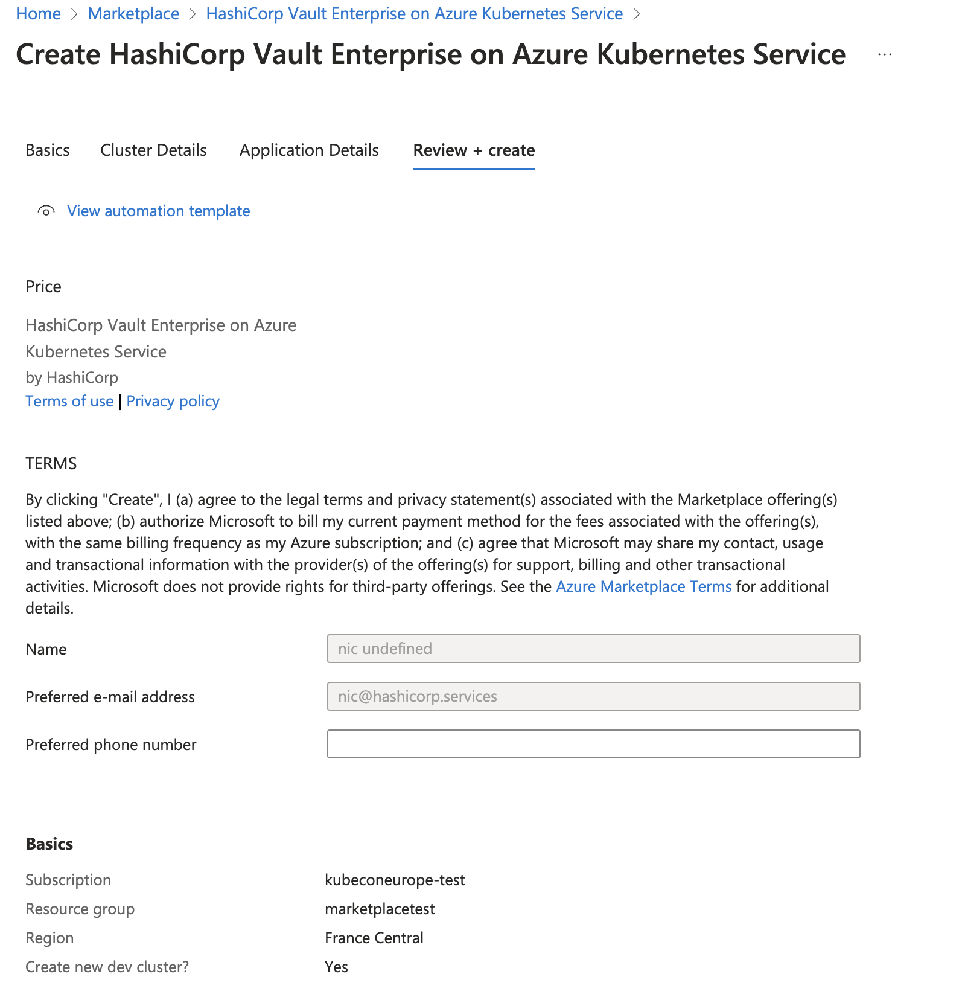

# Setup

## Prerequisites

* Vault CLI (https://releases.hashicorp.com/vault/1.15.6+ent/vault_1.15.6+ent_linux_amd64.zip)
* Vault Enterprise Licence
* Kubectl

## Configuring the Marketplace extension

In the Azure Marketplace search for `HashiCorp Vault Enterprise on Azure Kuberentes Service`



Click on the tile, select the plan and press create



You can then select your subscription, resource group and cluster. In this example
I am letting the extention create a new resource group and provision a Kubernetes cluster
for me.



Next configure the cluster details


And then the details for the application, to use the scripts from this library without
modification you need to ensure the name of the secret is `license`.



Finally you can press the `create` button and the Kubernetes cluster and Vault will be 
created.




## Setting Environment Variables

To use the scripts in this repository you need to set the following environment
variables.

```shell
export VAULT_K8S_NAMESPACE="<namespace you installed vault to>"
export VAULT_LICENSE="<your vault enterprise licence>"
```

## Step 1 - Setting the licence

First step is to create the Kubernetes secret that contains the Vault enterprise
licence. Vault will not start until this secret is present.

```shell
./1_set_licence.sh
```

## Step 2 - Initialize Vault

Next you need to initialize Vault, this step prepares the new Vault cluster
and generates the unseal keys and root token that you can use for initial 
configuration.

```shell
./2_init_vault.sh
```

The script creates a file `cluster-keys.json`, keep this file in a safe place
as it contains the Vault root token and also the unseal keys. If you loose these
keys you can not recover them nad the cluster will have to be re-created.


## Step 3 - Expose Vault

To configure Vault we need access to the API, we can do this on a temporary basis by using 
`kubectl port-forward` to expose the ports of a pod locally.

```shell
./3_expose_vault.sh
```


## Step 4 - Enable PKI

Next step is to enable the `pki` secret and to create a self signed root CA.

```shell
./4_enable_pki.sh
```

## Step 5 - Test Generate a Certificate

You can now use this endpoint to generate a certificate, this script generates
a leaf certificate for `app.marketplace.demo`

```shell
./5_generate_cert.sh
```


## Step 6 - Configure Kubenetes Authentication

To generate certificates you pods need to authenticate to Vault, they do this
using their Service Account Tokens. This step configures the Kubernetes Authentication
method for the cluster.

```shell
./6_configure_k8s_auth.sh
```


## Step 7 - Configure App Permissions

Now that the authentication has been configured we can configure the specific
permissions that each service account has. In this step you configure that the
`app` service account in the `default` namespace is allowed to create leaf certificates
for `app.marketplace.demo`.

```shell
./7_configure_app_permissions.sh
```


## Step 8 - Deploy the Application

Next you can deploy the demo application, the application has been configured
to request a TLS certificate from Vault and configure the transport of the service
using it.

```shell
./8_deploy_app.sh
```


## Step 9 - Testing the Application

Finally, let's test the application, this script first exposes the application
using `kubectl port-forward`. Then it retrieves the CA from Vault, and
runs some diagnostics.

It first connects to the service using openssl to display the transport certificate.

```shell
openssl s_client -connect localhost:1443 -CAfile ./ca.pem <<< "Q"
```

And then it curls the application using the self signed certificate, because the 
domain for the application does not resolve to a valid DNS domain, the `--resolve`
flag is used instead of an official DNS entry or the `-k` insecure certificates flag.

```shell
curl --cacert ./ca.pem --resolve app.marketplace.demo:1443:127.0.0.1 https://app.marketplace.demo:1443
```